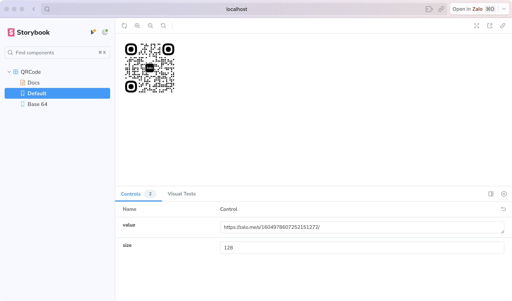

# Zalo QR Code Generator

React component for generating QR Code that look good on Zalo mini programs.

## Installation


```bash
npm i zqr-code-generator
```

## Usage

```jsx
import React from 'react'
import { QRCode } from 'zqr-code-generator'

const ScanMe = () => {
  const value = 'https://www.npmjs.com/package/zqr-code-generator'
  const image = 'https://stc-zaloprofile.zdn.vn/pc/v1/images/logo.svg'

  return <QRCode rounded value={value} image={image} />
}
```



## API Documentation

### QRCode

|Name|Description|Default|
|--- |--- |--- |
|value*|string|-|
|image*|string|-|
|rounded|boolean|false|
|size|number \| "auto"|auto|
|type|"canvas" \| "svg"|-|
|shape|"square" \| "circle"|-|
|width|number|-|
|height|number|-|
|margin|number|-|
|data|string|-|
|qrOptions|{ typeNumber?: TypeNumber; mode?: Mode; errorCorrectionLevel?: ErrorCorrectionLevel; }|-|
|imageOptions|{ hideBackgroundDots?: boolean; imageSize?: number; crossOrigin?: string; margin?: number; }|-|
|dotsOptions|{ type?: DotType; color?: string; gradient?: Gradient; }|-|
|cornersSquareOptions|{ type?: CornerSquareType; color?: string; gradient?: Gradient; }|-|
|cornersDotOptions|{ type?: CornerDotType; color?: string; gradient?: Gradient; }|-|
|backgroundOptions|{ round?: number; color?: string; gradient?: Gradient; }|-|


## Contributing
Pull requests are welcome. For major changes, please open an issue first to discuss what you would like to change.

Please make sure to update tests as appropriate.

## License
[MIT](https://choosealicense.com/licenses/mit/)